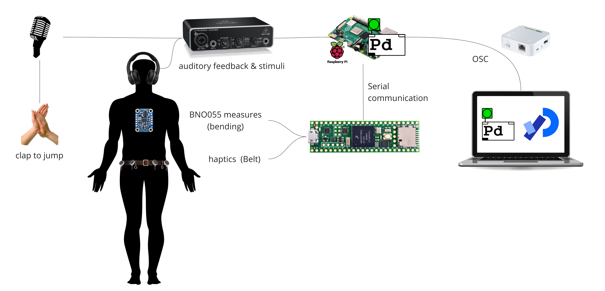

# SensoRoll

## Overview
SensoRoll is a ball race game designed and developed as part of the course *Multisensory Interactive Systems* at Uni Trento. The game challenges players to maneuver a ball to the end of a track while avoiding obstacles. It combines motion tracking, auditory feedback, and haptic signals to create an engaging, interactive, multisensory experience.

## Video
Both gameplay and system architecture can be seen in [this video](https://www.youtube.com/watch?v=puyx5cFv9Bs)

## Details

The unique feature of SensoRoll is its inclusivity: it is designed to be accessible for both blind and sighted individuals. It therefore offers two modes.
### Modes  
- **visual mode**: seeing the game on a laptop screen
- **auditory/haptics mode**: utilizes sound and haptic feedback to map what is happening on the screen and guide players through the game.

For sighted people, the auditory/haptics mode provides a chance to look beyond the visual-first paradigm and experience relying on other senses.

### Obstacles

- yellow walls to be dodged by tilting the torso
- red walls to be jumped over by clapping

### System Architecture

